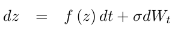

# Complex Stuart-Landau lattice model in *Python* and *julia*

To cite this code, please use:   
Code used in the article: https://doi.org/10.1016/j.neuroimage.2020.117372

This repo contains implementations of a coupled oscillator model following the complex Stuart-Landau equations (CSLE) on a 2D lattice.  
The code is available in Python and Julia.  

**Ref.:** Aranson, I.S., Kramer, L., The world of the complex Ginzburg-Landau equation. __*Rev Mod Phys*__ 74(1):99-143, 2002.

**Rendered page:** https://frederic-vw.github.io/csle-2d/

**_Python_ Requirements:**
1. [python](https://www.python.org/) installation, latest version tested 3.6.9
2. python packages (`pip install package-name`)
  - NumPy
  - Matplotlib
  - SciPy
  - opencv-python (save data as movie)

**_Julia_ Requirements:**
1. [julia](https://julialang.org/) installation, latest version tested 1.6.1
2. julia packages (`julia > using Pkg; Pkg.add("Package Name")`)
  - Interpolations
  - NPZ
  - PyCall (load Matplotlib animation functionality)
  - PyPlot
  - Statistics
  - VideoIO (save data as movie)

## Stuart-Landau model

The lattice model is defined by:

Noise is added via stochastic integration:

The main function call running the simulation is: `csle2d(N, T, t0, dt, s, D, mu0, mu1)`:  
- `N`: lattice size `(N,N)`
- `T`: number of simulation time steps
- `t0`: number of 'warm-up' iterations
- `dt`: integration time step
- `s`: noise intensity (&sigma;)
- `D`: diffusion constant
- `mu0,mu1`: bifurcation parameter (start, end values)

**Outputs:** `(T,N,N)` array as NumPy .npy format and as .mp4 movie.

### Example-1
Parameters:  
`N = 128, T = 2500, t0 = 0, dt = 0.05, s = 0.05, D = 1.0, mu0 = -0.05, mu1 = 0.5`

<video src="videos/csle2d_mu0_-0.05_mu1_0.50_s_0.05_D_1.00.webm" width="256" height="256" controls preload></video>

